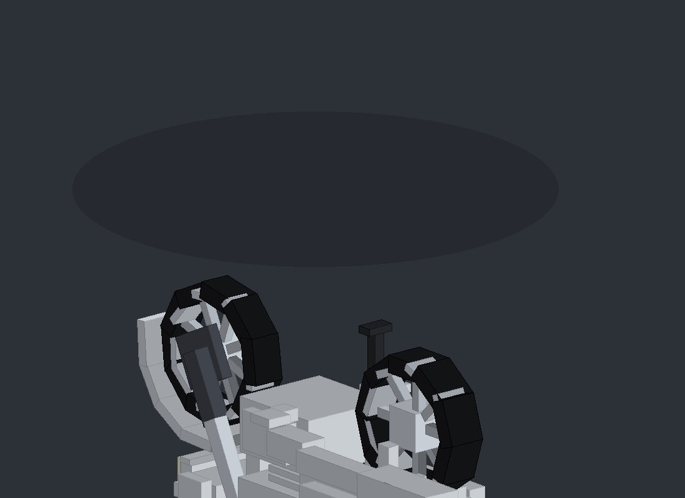

# Wave 100 — a rideable underbone motorcycle for NeoForge 1.21.1

A complete, standalone NeoForge mod that adds a Honda Wave 100 style
underbone motorcycle to Minecraft 1.21.1 (Java 21). Works in singleplayer
and on multiplayer servers; no external client mods required.



## Features

- **Real vehicle feel** — velocity-based physics (acceleration, braking,
  reverse, friction, traction, gravity, air control), ~60 km/h top speed,
  4-speed automatic gearbox, RPM simulation with idle/cruise/redline bands.
- **Animations** — steering handlebars + fork, speed-based lean, wheelies
  (SPACE) with balance physics, front-suspension compression on braking and
  landings, wheel rotation from actual travel, side stand that swings out
  when parked, engine vibration at idle.
- **Lights** — headlight toggle (F) with emissive lens and light beam,
  brake light that flares when braking.
- **Damage & fuel** — condition affects engine power and adds exhaust smoke;
  destroyed bikes are removed (and can drop the item). Fuel tank with
  RPM-scaled consumption; refuel with coal/charcoal, repair with iron ingots.
- **Crashes** — exceeding the wheelie balance point or hard collisions dump
  the bike on its side; recover with right-click.
- **HUD** — speed, RPM bar, gear, fuel and light state while riding.
- **Sounds** — engine loop that follows RPM, start/stop, brake, crash,
  wheelie, light-switch clicks (vanilla placeholder audio; drop real OGGs in
  `assets/wave100/sounds/` and point `sounds.json` at them).
- **Multiplayer-safe** — fully server-authoritative movement; the client only
  sends input changes. Multiple bikes work independently.
- **Persistence** — position, fuel, damage, engine, lights, owner and lock
  survive restarts via entity NBT.
- **Ownership & lock** — `/wave lock`, `/wave unlock`; locked bikes can't be
  ridden or picked up by others (configurable).

## Controls

| Input | Action |
|-------|--------|
| Right-click (empty bike) | Mount |
| W / S | Accelerate / brake & reverse |
| A / D | Steer |
| SPACE (while accelerating) | Wheelie |
| R | Engine start/stop |
| F | Headlight on/off (offhand swap is suppressed while riding) |
| SHIFT | Dismount |
| Sneak + right-click (held coal/charcoal) | Refuel |
| Sneak + right-click (held iron ingot) | Repair |
| Sneak + right-click (empty hand) | Bike info |

## Crafting

```
I I I
I R I
I . I     I = iron ingot, R = redstone block
```

## Commands

`/wave give <player>`, `/wave spawn`, `/wave remove`, `/wave removeall`
(admin), `/wave info`, `/wave fuel <amount>`, `/wave lock`, `/wave unlock`,
`/wave reload` (config).

## Building

```bash
./gradlew build          # jar lands in build/libs/
```

Requires Java 21. The mod targets NeoForge 21.1.x for Minecraft 1.21.1 —
see `gradle.properties` for the pinned versions.

## Regenerating the model & textures

The bike geometry, entity textures, item icon and preview render are all
generated from one declarative spec:

```bash
pip install pillow
python3 tools/generate_model.py
```

This writes `WaveModel.java`, the entity textures, the item icon and
`docs/model_preview.png`. Tweak the spec at the top of the script
(part pivots, boxes, colors, face painters) and re-run — do not edit the
generated Java by hand.

## Configuration

Everything (speeds, wheelie limits, fuel, damage, lights, sounds) is
tunable in `wave100-common.toml` after first launch; reload with
`/wave reload`.

## Architecture

```
com.wave100
├── WaveMod            entry point / registration wiring
├── WaveConfig         all tunables (ModConfigSpec)
├── entity
│   ├── WaveMotorcycleEntity   the vehicle (riding, state, sync, sounds)
│   ├── WavePhysics            velocity physics + wheelie balance
│   └── WaveEngine             RPM + automatic gearbox
├── registry           entities, items, sounds, creative tab
├── item               placement item
├── command            /wave commands
├── network            C2S input payload + registration
└── client             (client-only) model, renderer, animation,
                       HUD, keybinds, input, engine sound
```

Nothing in `client` loads on a dedicated server.
